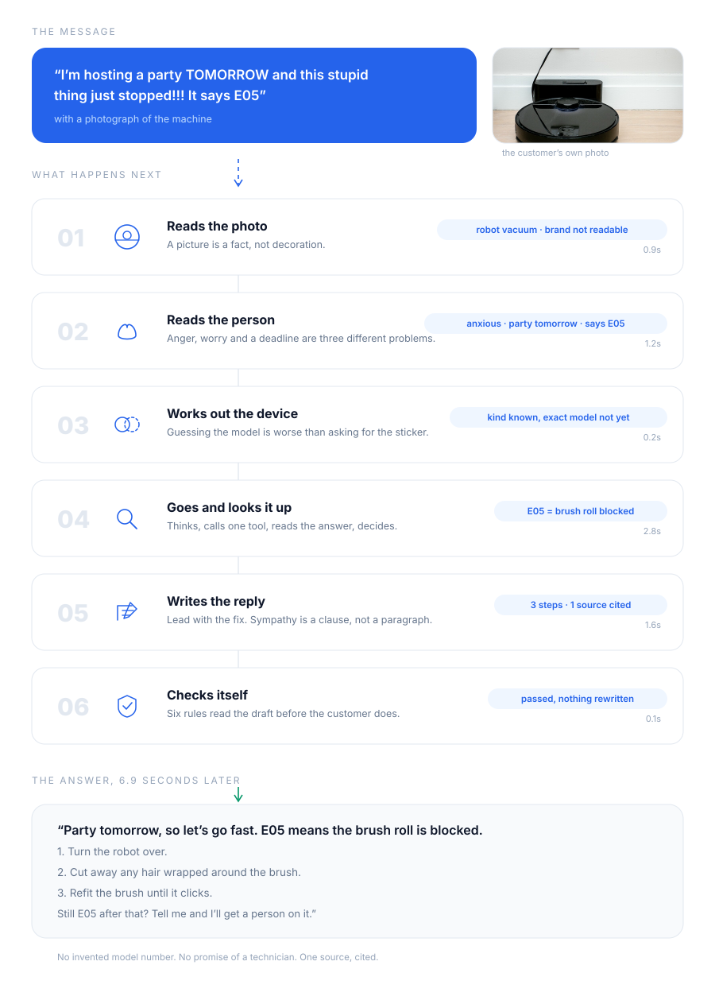
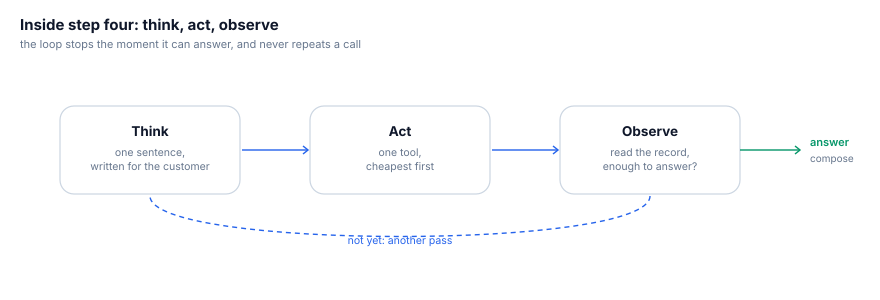
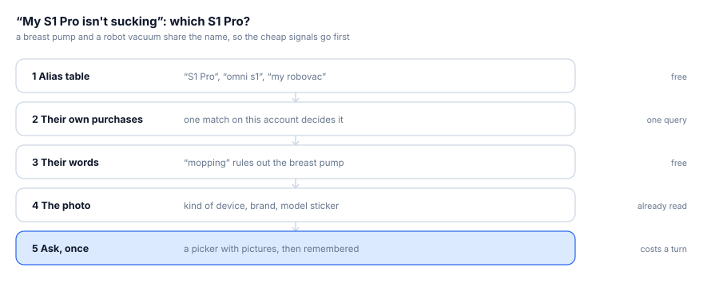
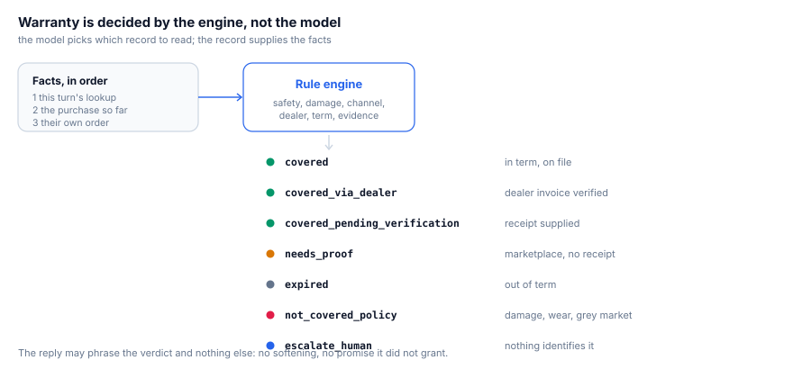
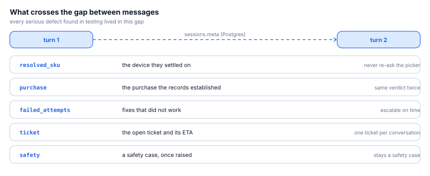
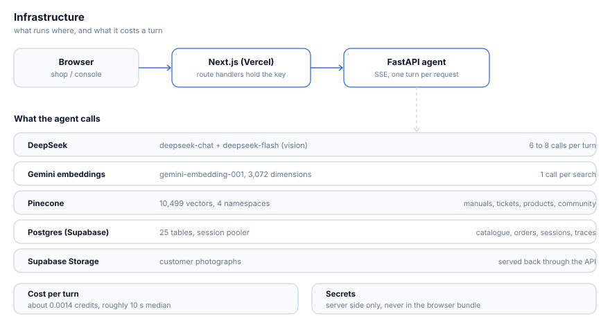

# From one message to one answer

**Ankor Care · 赛道四 智能服务**

A customer types one panicked sentence and attaches a photo. Six point nine seconds later
they have three steps that fix the machine. This is what happened in between.

Everything here was copied out of a recorded run of this build. Nothing was tidied up to
make the story neater.

---

## The whole turn, in one picture



---

## The message did more work than it looks

> **"I'm hosting a party TOMORROW and this stupid thing just stopped!!! It says E05"**

| What is in there | Why it matters |
|---|---|
| "party TOMORROW" | a real deadline, so the answer opens with the fix, not with sympathy |
| "stupid thing", "!!!" | anxiety, measured at 0.8, which changes how the reply is written |
| a photograph | the device is never named in words |
| "E05" | a code that can be looked up exactly, rather than searched for |

Four different problems, one sentence, and a customer who should not have to explain any
of it twice.

---

## What "reading the person" actually produces

One step, one small object. Everything after it is shaped by these few fields.

```json
{
  "emotion":   "anxious",
  "intensity": 0.8,
  "urgency":   { "has_deadline": true, "deadline_hint": "party tomorrow" },
  "intent":    "troubleshoot",
  "entities":  { "error_codes": ["E05"], "product_mentions": [] },
  "fix_failed": false,
  "language":  "en"
}
```

"Anxious 0.8 with a deadline" is exactly why the answer opens with six words and then the
steps. The same facts from a calm customer with no deadline produce a different shape of
reply.

---

## The part that takes the longest



It does not fire off every tool it has. It thinks one sentence, looks one thing up, reads
what came back, then decides whether anything else is needed.

| Pass | What it thought | What it did | What came back |
|---|---|---|---|
| 1 | "Let me look up what error E05 means on your device." | checked the error code | brush roll blocked, in 249 ms |
| 2 | "Good news, E05 is just a jammed brush roll, and it's a quick fix you can do tonight." | answered | loop ends |

Three habits keep it honest: look up the cheap certain thing before searching, treat an
empty result as information rather than a reason to try the same tool again, and stop as
soon as it can actually help.

One detail that mattered more than it should: the app screen says `E05`, the database says
`E-05`. Codes are now matched on their shape, so `E05`, `E-05` and `E5` are the same
fault. Before that, the headline demo answered "I have nothing on file for E05" while the
fix sat in the table under a dash.

---

## "My S1 Pro isn't sucking": which S1 Pro?



A breast pump and a robot vacuum share that name. Asking straight away is easy and wrong,
because the customer has usually already told you more than they realise.

In this run the signals ran out at the photo: it is clearly a robot vacuum, but no model
number is readable and nobody is signed in. So the agent answers at the level it is sure
of and asks for the sticker while it does. It does not guess a model, and it does not
refuse to help until it has one.

Two rules learned the hard way:

- A vague phrase never pins a specific model. "My Anker power bank" used to resolve to one
  product because the name table happened to have a single match, and three turns later
  the agent was still talking about it.
- Once the customer answers, the answer holds. Every later message starts from the device
  the conversation already settled.

---

## Warranty is not the model's opinion



An agent that improvises about warranty is a liability. So warranty is decided by a plain
piece of code that reads the records and returns one of seven verdicts. The reply is only
allowed to phrase that verdict: no softening it, no improving on it.

The facts come from records, in a fixed order: this turn's lookup first, then the purchase
the conversation already established, then the signed-in customer's own order. Anything
the model typed only fills gaps, and any disagreement is logged.

Two cases where this is the whole difference:

- **Grey market.** Order `GM774120` matches an invoice from a seller marked as not
  authorised. The verdict is "not covered", the claim goes to the seller, and a paid
  repair is offered instead.
- **Their own date.** "I bought it April 2024" with a twelve month term needs no receipt
  to answer. By the customer's own date it is out of term, so the answer is "expired"
  rather than "a human will have to check".

---

## What survives to the next message



The single message tests passed 27 of 27 from the beginning, and could not see a single
serious defect. Every one of them lived in the gap between two turns: a product forgotten,
a verdict that changed, a ticket opened twice, a safety warning that did not survive the
next question.

So the device, the purchase, the failed attempts, the open ticket and any safety concern
are written down as the turn ends and read back as the next one begins. That is the reason
"is it still under warranty?" does not re-open a picker the customer just answered.

---

## What it runs on



| Piece | What we use | Why |
|---|---|---|
| Agent | FastAPI, one turn per request, streaming | the customer watches the steps as they happen instead of a spinner |
| Front end | Next.js, calls made from the server | the API key never reaches the browser |
| Database | Postgres on Supabase, 25 tables | orders, sessions, messages and the full trail of what ran |
| Search | Pinecone, 10,499 vectors in 4 namespaces | manuals and FAQs, resolved tickets, product text, community answers |
| Photos | Supabase Storage | customer photographs, served back through the API |
| Text and vision | DeepSeek | measured here: reads a message in 0.9 s against 3.2 s for the alternative |
| Embeddings | Gemini, 3,072 dimensions | batched 100 chunks per request, because one per chunk looked like a hang |
| Judge | gpt-5 | a different family from the agent, so nothing grades its own writing |

**What the data actually is:** 1,493 products with prices checked against the live stores,
14,799 help articles cut into 8,764 searchable pieces, 106 error codes, 42 repair flows,
207 orders, 56 dealer invoices, 349 resolved tickets.

**What a turn costs:** about 0.0014 credits and six to eight model calls. Median answer
about 10 seconds; 25 seconds for the slowest turns, which are the ones with a photograph
and a long chain of lookups.

**Three operational notes worth keeping:** secrets stay on the server and never enter the
browser bundle; the deep health check is deliberately separate from the one the container
polls, because pinging four services on a timer is thousands of pointless requests a day;
and an embedding key that travelled in a URL ended up in 825 log lines in one afternoon,
so it travels in a header now.

---

## How we knew it worked

The interesting failures happen between turns, so the tests are conversations rather than
messages.

- **30 scripted customers, 64 turns**, driven through the real API.
- They **click the real buttons** and **send real photographs**.
- Chinese, Indonesian and English, in the same suite.
- Every turn gets structural checks; then a judge from a different model family reads the
  whole transcript together with what each tool actually returned, so it can tell an
  invented fact from a grounded one.
- **246 unit tests**, 33 of them written from defects this found.

**29 of 30 conversations pass**, up from 12 when the harness was first pointed at the
agent. The judge's score for following its own rules went from 1.12 to 4.75 out of 5.

What those tests caught, none of which the single message suite could see:

1. Anyone could read anyone else's orders just by naming their email address.
2. The same dealer order produced three different verdicts in three turns.
3. An unauthorised grey market seller came out as covered.
4. The product the customer had just picked was forgotten on the next message.
5. `E05` on the screen never matched `E-05` in the table.
6. "Still not working", said three times, produced the same three steps three times.
7. A safety warning did not survive to the next message.
8. A second ticket was opened while the first was forgotten.

All eight are fixed, and each has a test that fails again if the defect comes back.

---

## Try it, or run it

```bash
python run.py                                   # the agent, on :8000
python scripts/eval_run.py --no-judge           # 27 scenario cases
python scripts/eval_conversations.py            # 30 conversations, judged
python scripts/eval_conversations.py --name c01 # the one in this document
python -m pytest -q                             # 246 unit tests
```

The same walkthrough is live at `/workflow` in the web app, and prints to PDF from there.
